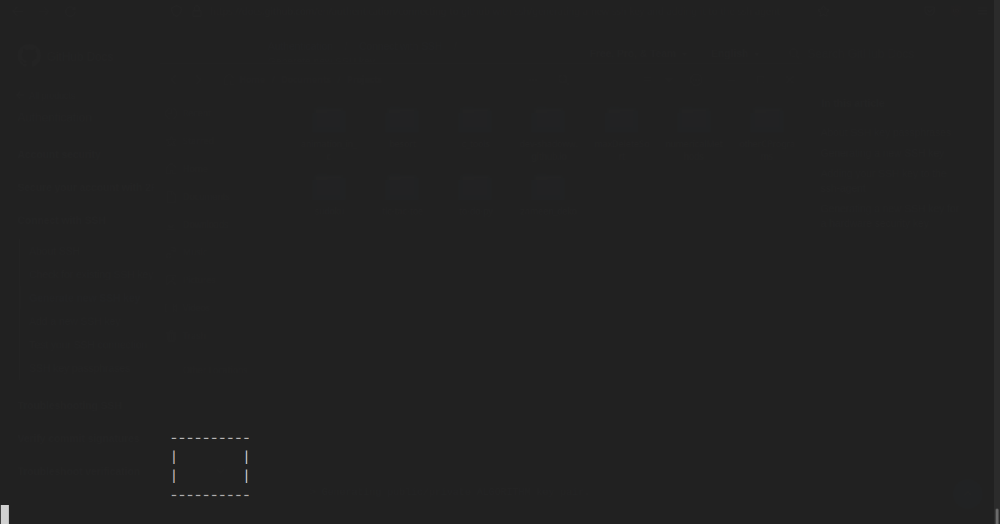
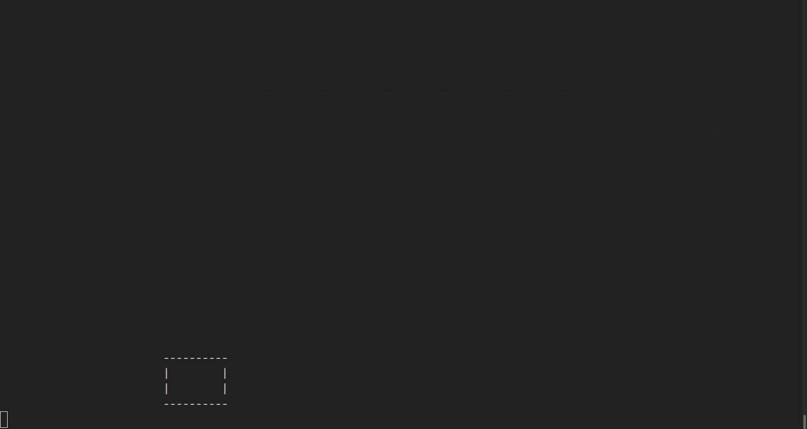
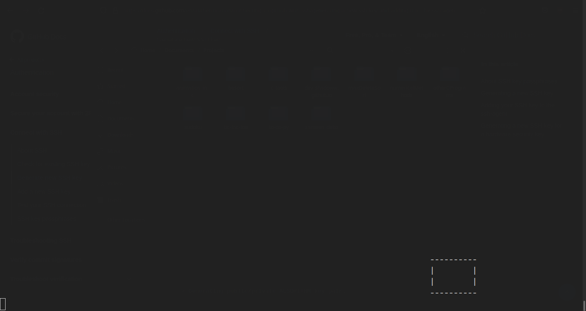
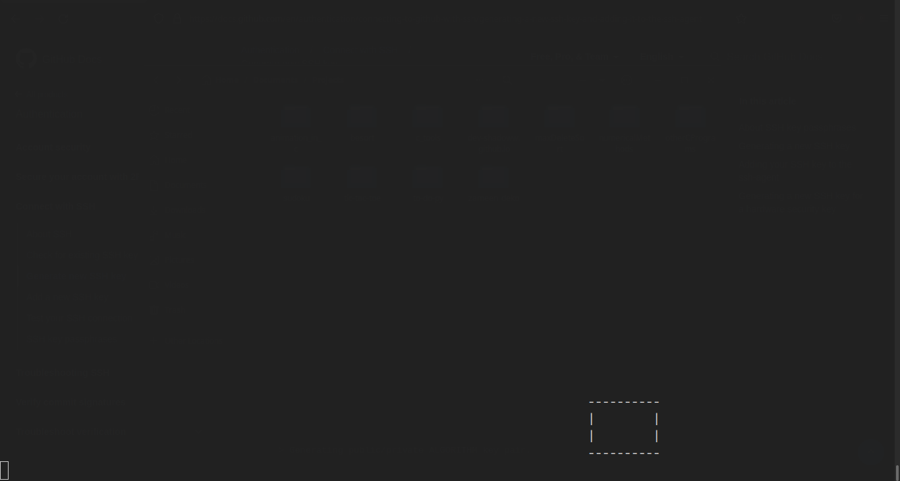
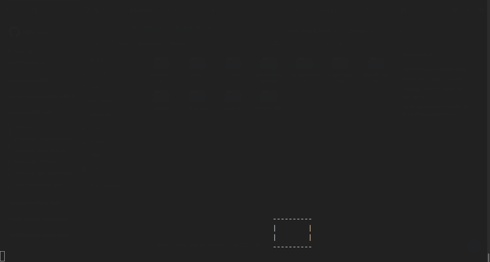

# ANIMATION IN C WITHOUT ANY LIBRARIES

This repository contains c program to perform basic animation without any libraries. At this stage very few animations are programmed but more will be added.

## OUTPUT

### Movement of box from right

### Movement of the box from left

